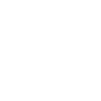

# ProductStore - QA - WEB Testing

<div align="center">
  <a href="https://github.com/group3-musiclab/MusicLab-QE-WebTesting">
    
  </a>

  <p align="center">
    Capstone Program Immersive Alterra Academy
    <br />
    <a href="https://docs.google.com/spreadsheets/d/1plAhm1UD1oTVwoG6pmDiKPVjopUYKIAN-7c_ISadVF8/edit?usp=sharing"><strong>| Test Case Web Documentation |</strong></a>
    <br />
    <br />
  </p>
</div>

## ⚙️ SUMMARY REPORT

<div align="center">
  
</div>

## 🛠️ How to Run Locally

- Clone it

```
$ git clone https://github.com/group3-musiclab/MusicLab-QE-WebTesting.git
```

- Go to directory

```
$ cd MusicLab-QE-WebTesting
```

- Run the project with the capstone being the main tag

```
$ mvn clean test
```

# 🤖 Author

Aldan Maulana Fajri <br> [](https://github.com/RenPaijo)